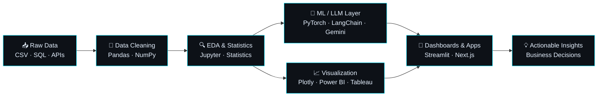
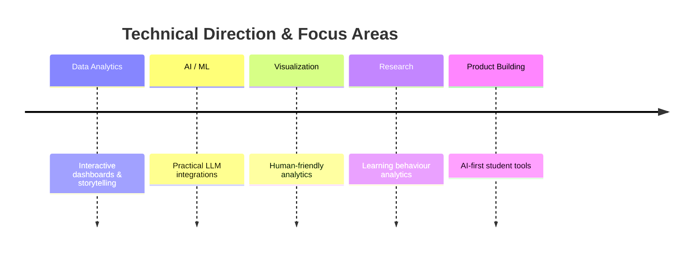

<div align="center">


<br><br>

<a href="https://github.com/Tarannum2504"></a>
<a href="https://github.com/Tarannum2504?tab=followers"></a>
<a href="https://github.com/Tarannum2504?tab=repositories"></a>
<a href="mailto:tarannum.k2504@gmail.com"></a>


</div>

---

## 👨‍💻 About Me

```text
┌──(tarannum㉿analytics)-[~]
└─$ whoami

    Tarannum Khan

    📊  Data Analytics Engineer  ·  AI · ML · Visualization
    📈  Predictive Analytics · KPI Visualization · Business Intelligence
    🤖  LLM Integrations · Recommendation Systems · Intelligent Automation
    💻  Python · SQL · Pandas · NumPy · PyTorch · Power BI · Tableau
    💡  "Good analytics should explain behaviour, reveal patterns & support decisions"
    🎯  Building data-first products and turning complex data into actionable insights
```

- 🔭 Currently building **Infera Study AI** & **AskQL** — AI-powered adaptive learning & natural language analytics
- 🌱 Focusing on **predictive analytics, intelligent automation, and large language models**
- 💬 Ask me about **Python, SQL, Business Intelligence, Dashboards, EDA or AI/ML**
- 📫 Reach me at **[tarannum.k2504@gmail.com](mailto:tarannum.k2504@gmail.com)**
- ⚡ Philosophy: *"Data tells stories. AI gives them intelligence."*

---

## 🛠️ Tech Stack

<div align="center">


<br><br>


</div>

---

## 🔄 Analytics & AI Workflow



---

## 🚀 Featured Projects

<div align="center">

| Project | What it does | Stack |
|:--|:--|:--|
| 📚 **Infera Study AI** | AI-powered adaptive learning & student analytics platform | `Python` `Next.js` `PyTorch` |
| 🧠 **AskQL** | Natural language to SQL analytics engine | `LangChain` `Gemini API` `SQL` |
| 🚌 **EduBus Tracker** | Fleet optimization & transport analytics platform | `Streamlit` `Pandas` `Folium` |
| 🔍 **ExploraAI** | Interactive EDA & visualization simulator | `Plotly` `Python` `Analytics` |
| 📊 **Data Analytics Tutorial** | In-progress learning repo: Python, SQL, EDA, Statistics, Visualization, Storytelling, ML via notebooks, exercises and real-world projects | `Python` `SQL` `Jupyter` |
| 🏢 **Sinero ERP** | Internship contribution to an ERP system: Inventory, Planning, User Management modules | `TypeScript` `ERP` |

<br>

<a href="https://github.com/Tarannum2504?tab=repositories">
  
</a>

</div>

---

## 🎯 What I Enjoy Building

<div align="center">

<table>
<tr>

<td width="33%" valign="top">

### 📈 Analytics
- Dashboard Design
- KPI Visualization
- Business Insights
- Data Storytelling

</td>

<td width="33%" valign="top">

### 🤖 AI Systems
- LLM Applications
- Predictive Models
- AI Automation
- Recommendation Systems

</td>

<td width="33%" valign="top">

### 🎨 Product Thinking
- Clean UX
- Data-first Products
- Workflow Optimization
- Real-world Solutions

</td>

</tr>
</table>

<br>

```text
I enjoy building systems where analytics, AI, and design work together seamlessly.
```

</div>

---

## 📊 GitHub Analytics

<div align="center">


<br><br>


<br><br>


<br>


<br><br>


</div>

---

## 🧭 Current Focus



---

<div align="center">

### 💭 Dev Quote of the Day


</div>

---

## 🤝 Connect With Me

<div align="center">

<a href="mailto:tarannum.k2504@gmail.com"></a>
<a href="https://www.linkedin.com/in/tarannum2504"></a>
<a href="https://instagram.com/infera.labs"></a>
<a href="https://github.com/Tarannum2504"></a>

<br><br>

*📊 Data Analytics · 🤖 AI & ML · 📈 Data Storytelling · 💡 Intelligent Systems*

<br>


**"Data tells stories. AI gives them intelligence."**

</div>
